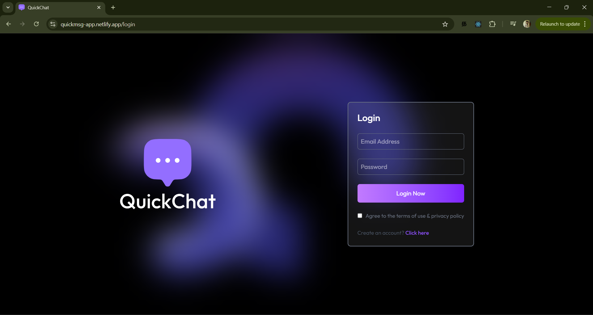
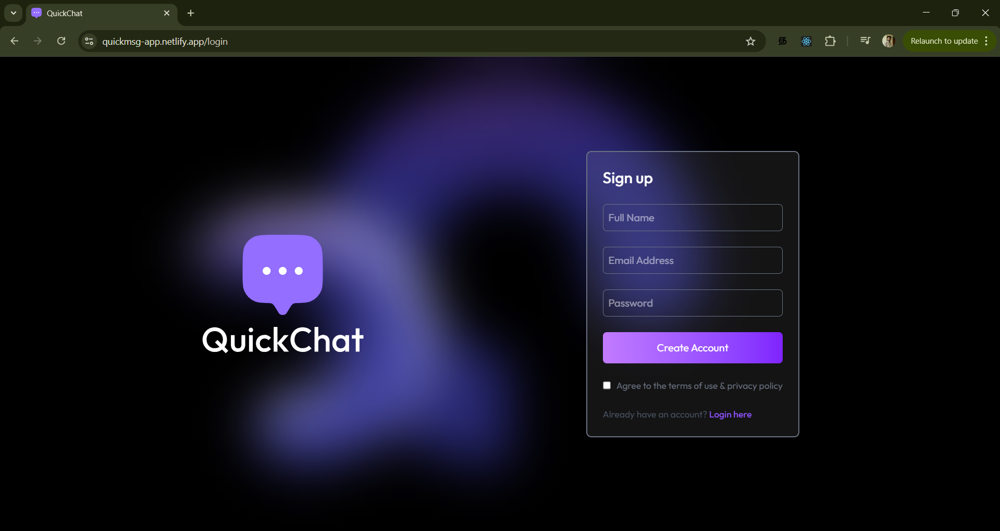
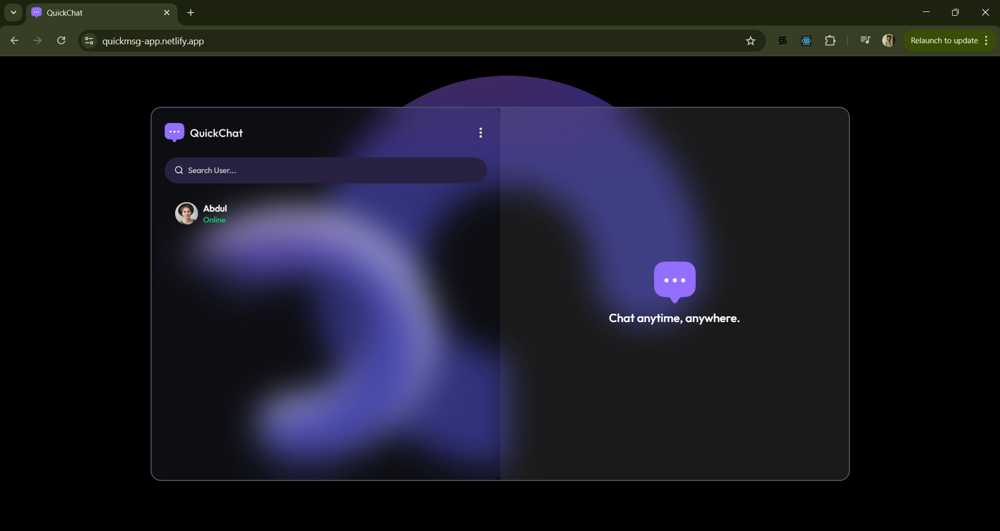
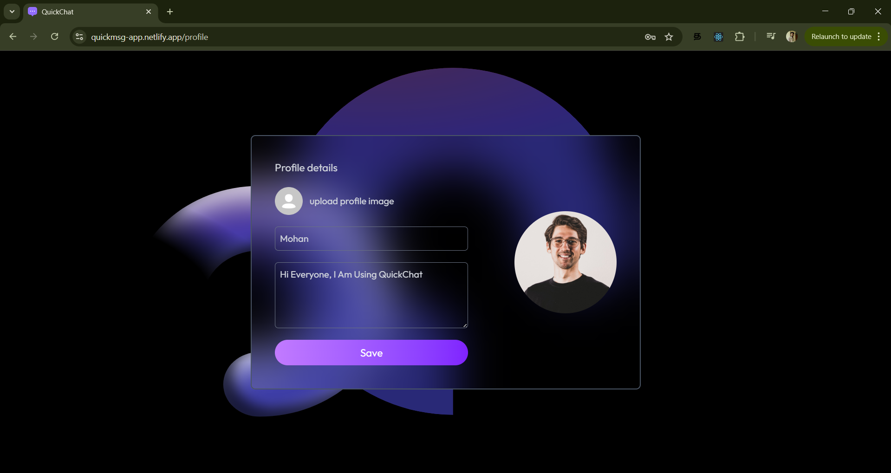
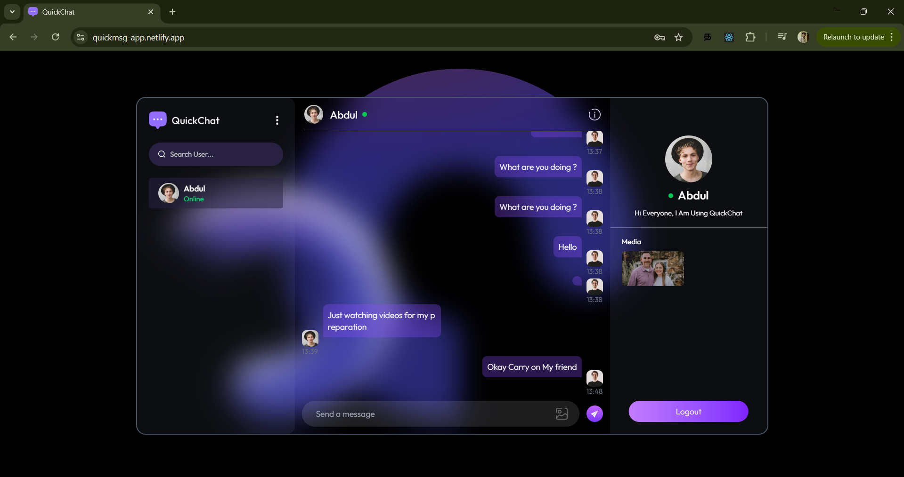

# 🗣️ QuickChat | Real-time Conversations, Reimagined.

[](https://reactjs.org/)
[](https://tailwindcss.com/)
[](https://nodejs.org/)
[](https://www.mongodb.com/)
[](https://socket.io/)

**QuickChat** is a polished, full-stack real-time messaging platform designed for seamless communication. Built with the MERN stack and powered by Socket.io, it offers low-latency message delivery, graceful connection handling, and a modern user experience.

---

## ✨ Features

- **Instant Messaging**: Real-time 1-to-1 conversations with zero refresh lag.
- **Smart Online Status**: Accurate real-time tracking of users' online/offline presence across multiple tabs.
- **Typing Indicators**: Visual cues when your contacts are actively typing to you.
- **Media Support**: Effortless image sharing integrated with Cloudinary for optimized delivery.
- **Unseen Message Tracking**: Persistent notification system for missed messages.
- **Perfect Scrolling**: Intelligent scroll-to-bottom logic that accounts for dynamic media loading.
- **Responsive Design**: A sleek, dark-themed UI that works beautifully on mobile and desktop.

---

## 🛠 Tech Stack

### Frontend
- **React 18** (Vite)
- **Tailwind CSS** (Styling)
- **Axios** (API requests)
- **React Hot Toast** (Notifications)

### Backend
- **Node.js & Express**
- **Socket.io** (Real-time engine)
- **Mongoose** (ODM)
- **Cloudinary** (Image storage)
- **JWT** (Authentication)

### Database
- **MongoDB Atlas** (Cloud Database)

---

## 📂 Project Structure

```bash
├── backend
│   ├── config        # Database & Cloudinary setup
│   ├── controller    # Business logic (messages, auth)
│   ├── middleware    # Auth & error handling
│   ├── model         # Mongoose schemas
│   ├── routes        # API endpoints
│   └── socket.js     # Real-time room & event logic
├── frontend
│   ├── src
│   │   ├── components # Chat, Sidebar, UI elements
│   │   ├── context    # Auth & Chat state management
│   │   ├── pages      # Login, Profile, Home
│   │   └── lib        # Utility functions
└── README.md
```

---

## ⚙️ Installation & Setup

### 1. Clone the repository
```bash
git clone https://github.com/SGMohan/Chat-App.git
cd Chat-App
```

### 2. Configure Backend
```bash
cd backend
npm install
# Create a .env file (see Environment Variables section below)
npm start
```

### 3. Configure Frontend
```bash
cd ../frontend
npm install
npm run dev
```

---

## 🔌 Environment Variables

### Backend (`/backend/.env`)
```env
PORT=3000
MONGODB_URI=your_mongodb_connection_string
JWT_SECRET=your_jwt_secret
CLOUDINARY_CLOUD_NAME=your_name
CLOUDINARY_API_KEY=your_key
CLOUDINARY_API_SECRET=your_secret
```

### Frontend (`/frontend/.env`)
```env
VITE_BACKEND_URL=http://localhost:3000
```

---

## 📸 Screenshots

<div align="center">
  
  
  <br />
  
  
  <br />
  
</div>


---

## 🧠 Key highlights

- **Room-Based Logic**: Uses Socket.io rooms to ensure that message delivery is targeted and decoupled, handling millions of potential concurrent conversations efficiently.
- **Multi-Tab Sync**: Intelligent connection counting prevents users from appearing offline if they only close one of many open tabs.
- **Optimistic Performance**: The UI reacts instantly to user input while ensuring database consistency behind the scenes.

---

## 🚧 Future Improvements

- [ ] Group Messaging support.
- [ ] End-to-end encryption for private chats.
- [ ] Message reactions and thread replies.
- [ ] Video/Voice calling integration via WebRTC.

---

## 🌐 Deployed Project URLs

- **Frontend (Netlify):** [https://quickmsg-app.netlify.app/](https://quickmsg-app.netlify.app/)
- **Backend (Render):** [https://chat-app-82v1.onrender.com](https://chat-app-82v1.onrender.com)

---

## 📄 License

Distributed under the MIT License. See `LICENSE` for more information.

---

<p align="center">Made with ❤️ for modern communication.</p>
